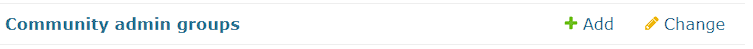

# Create A Community Admin Account

**1. Follow [Create SAdmin Account](/docs/guides/create-super-admin.md) tutorial.**

**2. Add new CAdmin profile to the applicable community.**

a. From the main page of the Django's admin portal, click on `Community admin groups` under `DATABASE`.

b. Scroll down to `Select community admin group to change` and click on the community you want to add your admin to.

c. Scroll down to `Change community admin group`.

d. Find and select your email address in `Members:`

e. Click `SAVE` at the bottom of the page to save your changes.

f. Log in to [frontend-admin](/docs/installation/frontend-admin) with your new admin profile!