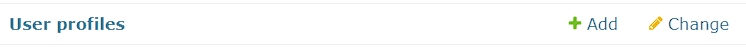
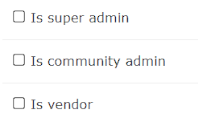

# Create A Super Admin Account

**1. Be sure `api/src/_main_/settings.py` is set to run from the local database. Not PROD or CANARY.**


**2. Create a superuser by running the following command:**
:::info
You can skip this step if you already have a **superuser** account.
:::
:::danger important
This credential is really important for next steps or when you want to add more admins in the future. Make sure to remember your username and password!
:::

```
python manage.py createsuperuser
```


**3. Create a profile on frontend-portal that will later turn into an admin.**

:::danger important
Create the profile with email and password method. Profiles created with passwordless authentications will not be able to log in to the admin portal.
:::

a. Make sure API and local database are running in the background:
```
python manage.py runserver
```

b. Run local [frontend-portal](/docs/installation/frontend-portal) in another terminal to create the profile:
:::note
Choose any community to create your profile.
:::
```
npm start
```

c. Complete filling out the new user's profile by clicking the email verification link and filling out the form.

**4. Assign admin role to newly created profile.**

a. While the API and local database are still running in the background, navigate to [localhost:8000/admin/](http://localhost:8000/admin/) to access Django's admin portal.
:::info
This portal is where we will be able to make our own existing user profile into a community admin (CAdmin) or a super admin (SAdmin).
:::

b. Log in to the portal with the credentials you created from step 2.

c. Click `User Profiles` on the list of options under `DATABASE`.



d. Scroll down to the section labeled `Select user profile to change` and find the profile we set up in step 3. It will show profiles by email address.

e. Click on the profile we created and scroll down to `Change user profile` section.

f. Keep scrolling until you see a checkbox section to select admin role and select applicable option.



g. Click `SAVE` at the bottom of the page to save your changes.

h. Log in to [frontend-admin](/docs/installation/frontend-admin) with your new admin profile!