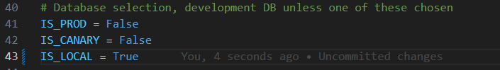
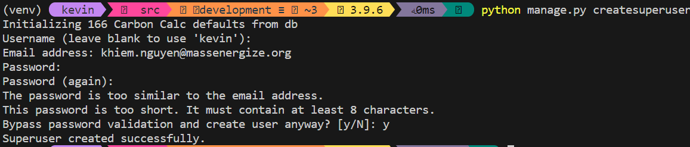

# Create A SuperAdmin Account

1. Be sure `api/src/_main_/settings.py` is set to run from the local database. Not PROD or CANARY.



2. Create a superuser by running the following command:
```
python manage.py createsuperuser
```



3. Create a profile on frontend-portal that will later turn into an admin.
:::info
Make sure to create the profile with email and password method. Profiles created with passwordless authentications will not be able to log in to the admin portal.
:::

Make sure API is running:
```
python manage.py runserver
```

Run local [frontend-portal](/docs/installation/frontend-portal) to create the profile:
```
npm start
```

Complete filling out the new user's profile by clicking the email verification link and filling out the form.